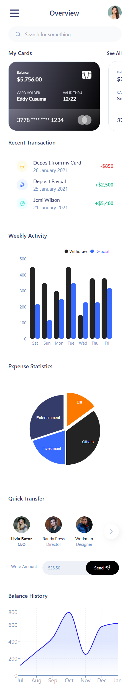
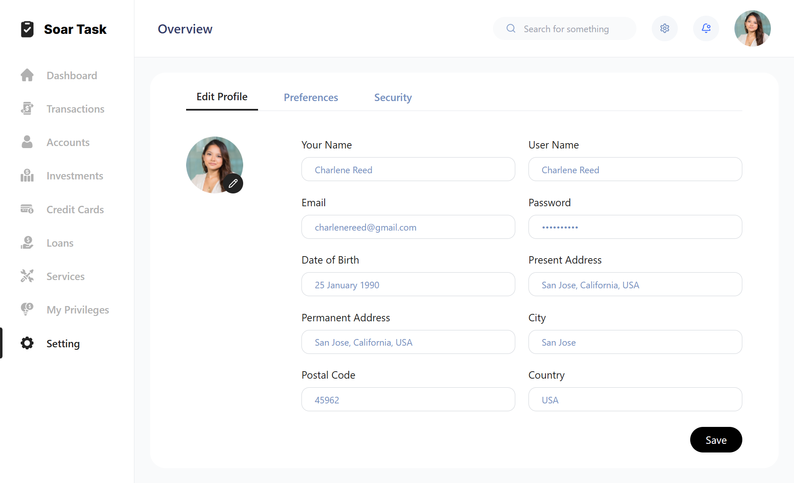
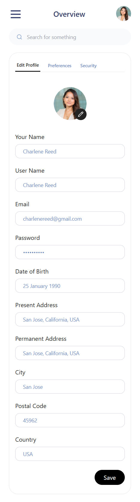
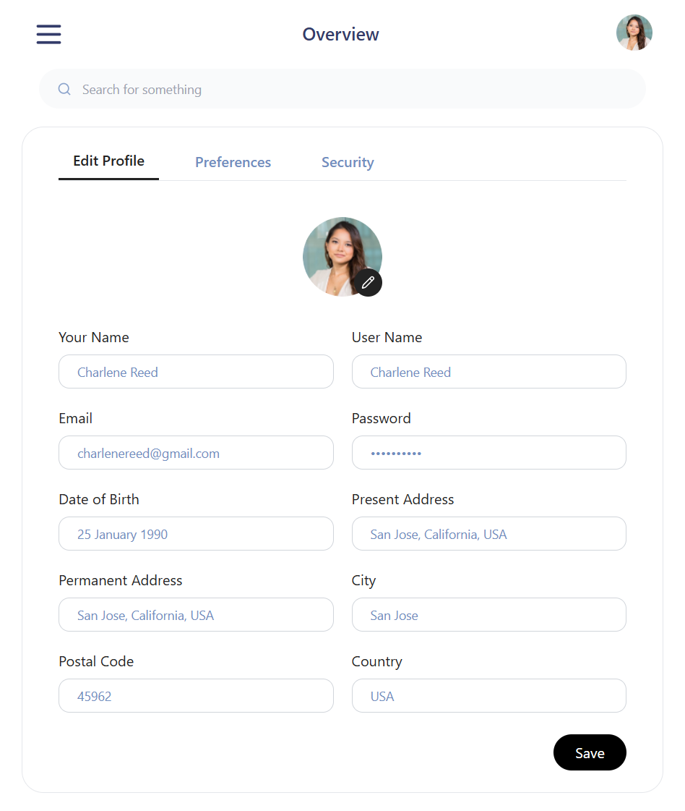

# Soar Task Manager

Soar is a responsive and interactive finance management dashboard designed to help users manage their accounts, transactions, credit cards, investments, loans, and more. It features a sleek and user-friendly interface, developed using modern technologies like React JS, TypeScript, and Vite for a smooth and performant user experience.
## Features

- **Responsive Design**: The UI is fully responsive, ensuring seamless experience across all devices, including desktops, tablets, and mobile phones.
- **Interactive UI**: Built-in interactive elements, such as hover and active effects, enhance user interaction. The project also includes smooth transitions and state handling.
- **Form Handling**:
  - Validation with **React Hook Form** and **Zod** for managing and validating forms with ease.
  - Proper error handling and validation messages are shown to guide users.
- **State Management**: Managed by **Redux Toolkit** for efficient global state management.
- **Charts and Analytics**:
  - **Recharts** and **React Google Charts** are used to provide visual representation of data like expense statistics and balance history.
  - **Lucid React icons** is used for jsx icons.
- **Lazy Loading & Skeletons**: Implemented lazy loading for optimized performance, and skeleton loading states for better user experience during data fetching.
- **Toast Notifications**: **React Toastify** provides user feedback on important actions (like success/error toasts).
- **Typescript**: Ensures type safety throughout the project, making the codebase more robust and maintainable.
- **Accessibility**: Includes support for accessibility with keyboard navigation, focus management, and screen reader-friendly components.
- **Code Quality & Formatting**:
  - **ESLint** is used for enforcing coding standards.
  - **Prettier** is used to maintain code formatting across the project.
## Built With

- **React JS** - A JavaScript library for building user interfaces
- **Vite** - A fast build tool for development and production
- **Tailwind CSS** - A utility-first CSS framework
- **React Router Dom** - For routing and navigation between pages
- **Zod** - For schema validation in forms
- **React Hook Form** - For handling forms and validation
- **Redux Toolkit** - For global state management
- **Lucid React** - For components and data visualization
- **React Google Charts** & **Recharts** - For charts and data visualizations
- **React Responsive** - For handling responsiveness
- **React Toastify** - For toast notifications
- **ESLint** - For linting and enforcing code quality
- **Prettier** - For code formatting

## How to Use

### Profile Management:
- Go to the "Settings" tab to view and edit your personal information, such as your name, email, and address.
- You can also update security settings like passwords here.

### Dashboard:
- View a summary of your financial activities, including recent transactions and account balances.
- Explore visual data, such as weekly activity, expense statistics, and balance history.
- Use the quick transfer feature to send money to contacts.

### Account and Transaction Management:
- Navigate through different sections like transactions, accounts, loans, services, and investments to manage your finances efficiently.

## Screenshot









## App Recording

[Watch App Recording](https://drive.google.com/file/d/1fdlmnqxqoex5KqywJtf5jyeLx621--bR/view?usp=sharing)


## Installation

To run the Task Timer App on your device, follow these steps:

### 1. Clone the Repository
```bash
git clone https://github.com/ShagunDubey1/soar.git
```

    
### 2. Install dependencies:

```bash
    npm Install
```

### 3. Start the development server:

```bash
   npm run dev
```
The app will be available at http://localhost:5173/
